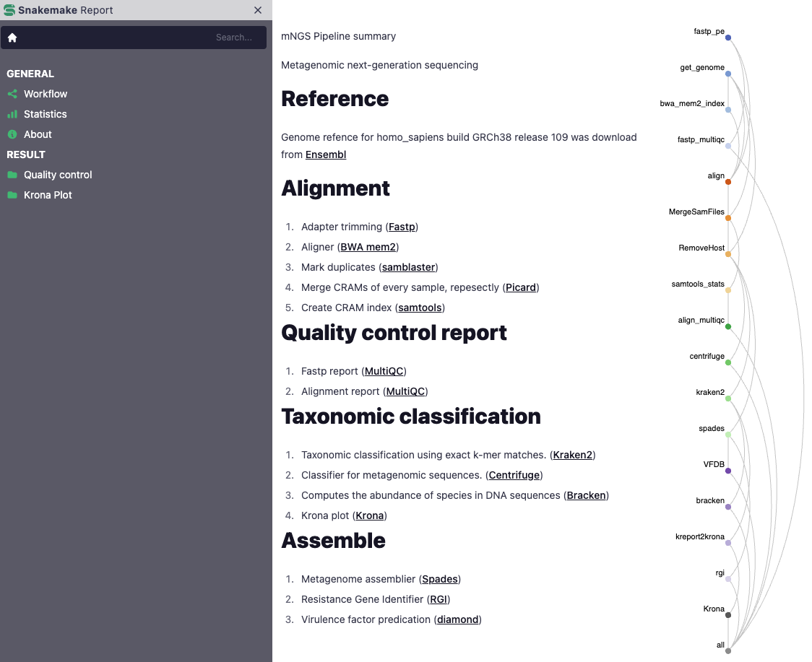
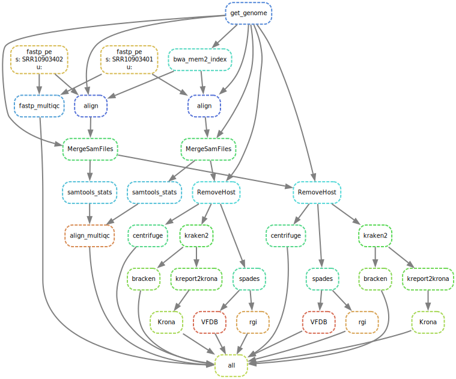
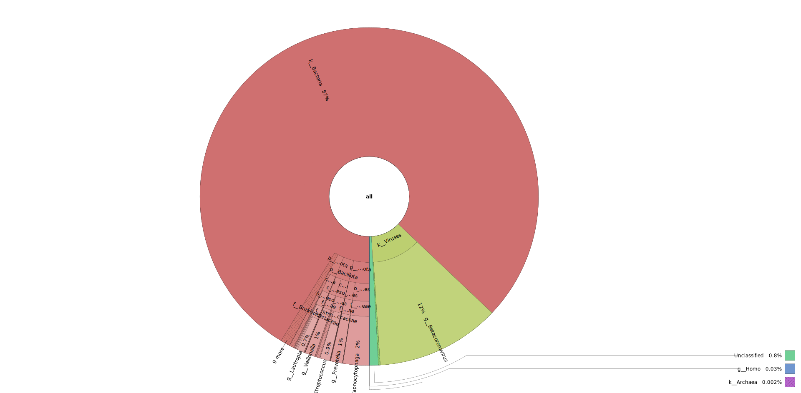

mNGS Pipeline summary

Metagenomic next-generation sequencing

## Reference
Genome refence was download from Ensembl
## Alignment
1. Adapter trimming ([`fastp`](https://github.com/OpenGene/fastp))
2. Aligner ([`BWA mem2`](http://bio-bwa.sourceforge.net))
3. Mark duplicates ([`samblaster`](https://github.com/GregoryFaust/samblaster))
4. Merge CRAMs of every sample, repesectly ([`Picard`](https://broadinstitute.github.io/picard))
5. Create CRAM index ([`samtools`](http://www.htslib.org))
## Quality control report
1. Fastp report ([`MultiQC`](https://multiqc.info))
2. Alignment report ([`MultiQC`](https://multiqc.info))
## Taxonomic classification
1. Taxonomic classification using exact k-mer matches ([`Kraken`](https://ccb.jhu.edu/software/kraken2))
2. Classifier for metagenomic sequences ([`Centrifuge`](https://ccb.jhu.edu/software/centrifuge/index.shtml))
3. Computes the abundance of species in DNA sequences ([`Bracken`](https://github.com/jenniferlu717/Bracken))
4. Krona plot ([`Krona`](https://github.com/marbl/Krona))
## Assemble
1. Metagenome assemblier ([`Spades`](https://github.com/ablab/spades))
2. Resistance Gene Identifier ([`RGI`](https://card.mcmaster.ca))
3. Virulence factor predication ([`diamond`](https://github.com/bbuchfink/diamond))
## SnakeMake Report

## Outputs
```text
.
├── config
│   ├── config.yaml
│   └── samples.tsv
├── dag.svg
├── logs
│   ├── align
│   ├── bracken
│   ├── centrifuge
│   ├── fastp
│   ├── kraken2
│   ├── kreport2krona
│   ├── Krona
│   ├── MergeSamFiles
│   ├── qc
│   ├── RemoveHost
│   ├── rgi
│   ├── spades
│   └── VFDB
├── raw
│   ├── SRR10903401.1.fastq.gz
│   ├── SRR10903401.2.fastq.gz
│   ├── SRR10903402.1.fastq.gz
│   └── SRR10903402.2.fastq.gz
├── README.md
├── report
│   ├── align_multiqc_data
│   ├── align_multiqc.html
│   ├── bracken
│   ├── centrifuge
│   ├── fastp_multiqc_data
│   ├── fastp_multiqc.html
│   ├── kraken2
│   └── Krona
├── report.html
├── results
│   ├── aligned
│   ├── centrifuge
│   ├── kraken2
│   ├── kreport2krona
│   ├── rgi
│   ├── spades
│   └── VFDB
└── workflow
    ├── envs
    ├── report
    ├── rules
    ├── schemas
    ├── scripts
    └── Snakefile
```
## Directed Acyclic Graph


## Krona Plot
